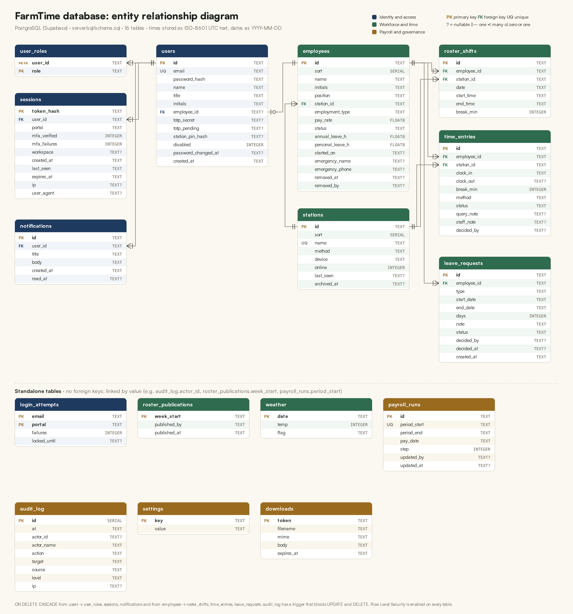
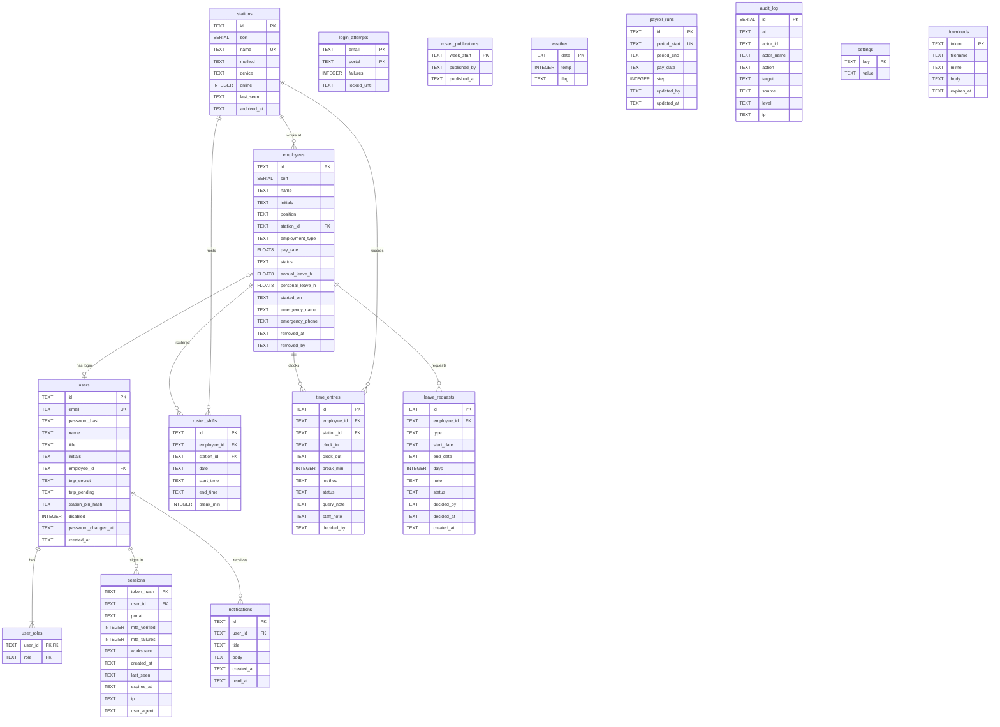

# FarmTime database ERD

Mermaid version (renders on GitHub):

```mermaid
erDiagram
  stations ||--o{ employees : "works at"
  employees |o--o| users : "has login"
  users ||--|{ user_roles : "has"
  users ||--o{ sessions : "signs in"
  users ||--o{ notifications : "receives"
  employees ||--o{ roster_shifts : "rostered"
  stations ||--o{ roster_shifts : "hosts"
  employees ||--o{ time_entries : "clocks"
  stations ||--o{ time_entries : "records"
  employees ||--o{ leave_requests : "requests"
  stations {
    TEXT id PK
    SERIAL sort
    TEXT name UK
    TEXT method
    TEXT device
    INTEGER online
    TEXT last_seen
    TEXT archived_at
  }
  employees {
    TEXT id PK
    SERIAL sort
    TEXT name
    TEXT initials
    TEXT position
    TEXT station_id FK
    TEXT employment_type
    FLOAT8 pay_rate
    TEXT status
    FLOAT8 annual_leave_h
    FLOAT8 personal_leave_h
    TEXT started_on
    TEXT emergency_name
    TEXT emergency_phone
    TEXT removed_at
    TEXT removed_by
  }
  users {
    TEXT id PK
    TEXT email UK
    TEXT password_hash
    TEXT name
    TEXT title
    TEXT initials
    TEXT employee_id FK
    TEXT totp_secret
    TEXT totp_pending
    TEXT station_pin_hash
    INTEGER disabled
    TEXT password_changed_at
    TEXT created_at
  }
  user_roles {
    TEXT user_id PK,FK
    TEXT role PK
  }
  login_attempts {
    TEXT email PK
    TEXT portal PK
    INTEGER failures
    TEXT locked_until
  }
  sessions {
    TEXT token_hash PK
    TEXT user_id FK
    TEXT portal
    INTEGER mfa_verified
    INTEGER mfa_failures
    TEXT workspace
    TEXT created_at
    TEXT last_seen
    TEXT expires_at
    TEXT ip
    TEXT user_agent
  }
  roster_shifts {
    TEXT id PK
    TEXT employee_id FK
    TEXT station_id FK
    TEXT date
    TEXT start_time
    TEXT end_time
    INTEGER break_min
  }
  roster_publications {
    TEXT week_start PK
    TEXT published_by
    TEXT published_at
  }
  time_entries {
    TEXT id PK
    TEXT employee_id FK
    TEXT station_id FK
    TEXT clock_in
    TEXT clock_out
    INTEGER break_min
    TEXT method
    TEXT status
    TEXT query_note
    TEXT staff_note
    TEXT decided_by
  }
  leave_requests {
    TEXT id PK
    TEXT employee_id FK
    TEXT type
    TEXT start_date
    TEXT end_date
    INTEGER days
    TEXT note
    TEXT status
    TEXT decided_by
    TEXT decided_at
    TEXT created_at
  }
  notifications {
    TEXT id PK
    TEXT user_id FK
    TEXT title
    TEXT body
    TEXT created_at
    TEXT read_at
  }
  weather {
    TEXT date PK
    INTEGER temp
    TEXT flag
  }
  payroll_runs {
    TEXT id PK
    TEXT period_start UK
    TEXT period_end
    TEXT pay_date
    INTEGER step
    TEXT updated_by
    TEXT updated_at
  }
  audit_log {
    SERIAL id PK
    TEXT at
    TEXT actor_id
    TEXT actor_name
    TEXT action
    TEXT target
    TEXT source
    TEXT level
    TEXT ip
  }
  settings {
    TEXT key PK
    TEXT value
  }
  downloads {
    TEXT token PK
    TEXT filename
    TEXT mime
    TEXT body
    TEXT expires_at
  }
```
